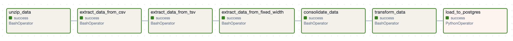
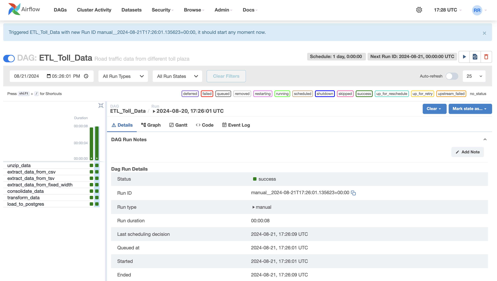
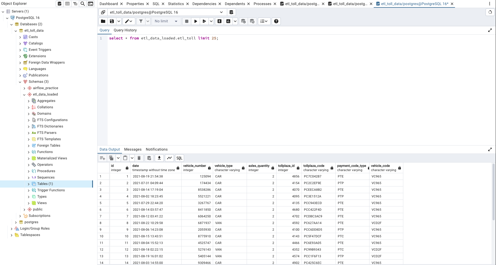

# ETL Pipeline for Toll Data Using Apache Airflow and PostgreSQL

<div align="center">
  
  <p><em>Apache Airflow | PostgreSQL</em></p>
</div>

## Introduction

In today's data-driven world, automating ETL (Extract, Transform, Load) processes is crucial for efficiently managing and processing data. This project demonstrates how to create an automated ETL pipeline using Apache Airflow and PostgreSQL. We will walk through the steps to extract data from various formats, transform it, and load it into a PostgreSQL database.

## Project Overview

The ETL pipeline consists of several steps:
1. Unzipping raw data files.
2. Extracting data from CSV, TSV, and fixed-width files.
3. Consolidating and transforming the extracted data.
4. Loading the transformed data into a PostgreSQL database.

<div align="center">
  
  <p><em>Task Pipeline</em></p>
</div>

## DAG Definition

We define a Directed Acyclic Graph (DAG) in Apache Airflow to orchestrate the ETL process. Below is the Python code to create the DAG:

```python
from datetime import timedelta
from airflow.models import DAG
from airflow.operators.bash import BashOperator
from airflow.utils.dates import days_ago
import psycopg2
from airflow.operators.python import PythonOperator
```

## Default Arguments

We define default arguments that apply to all tasks within the DAG, including the owner, start date, retry settings, and email notifications:

```python
default_args = {
    'owner': 'rnrolan',
    'start_date': days_ago(0),
    'email': ['example@gmail.com'],
    'email_on_failure': True,
    'email_on_retry': True,
    'retries': 1,
    'retry_delay': timedelta(minutes=5),
}
```

## Defining the DAG

The DAG is defined with a schedule interval of 1 day (`timedelta(days=1)`) and a description explaining its purpose.

```python
dag = DAG(
    'ETL_Toll_Data',
    default_args=default_args,
    description='Road traffic data from different toll plazas',
    schedule_interval=timedelta(days=1),
)
```

## Task Definitions

Each task in the DAG represents a step in the ETL process. Here’s a breakdown:

### Unzip Data

The `unzip_data` task uses the `BashOperator` to extract data from a `.tgz` archive.

```python
unzip_data = BashOperator(
    task_id='unzip_data',
    bash_command='tar -xzf /airflow_projects/tolldata.tgz -C /airflow_projects/staging',
    dag=dag,
)
```

### Extract Data from CSV

The `extract_data_from_csv` task extracts specific columns (1 to 4) from the CSV file using the `cut` command.

```python
extract_data_from_csv = BashOperator(
    task_id='extract_data_from_csv',
    bash_command='cut -d "," -f1-4 /airflow_projects/staging/vehicle-data.csv > /airflow_projects/staging/csv_data.csv',
    dag=dag,
)
```

### Extract Data from TSV

The `extract_data_from_tsv` task extracts columns 5, 6, and 7 from the TSV file, removing any carriage return characters.

```python
extract_data_from_tsv = BashOperator(
    task_id='extract_data_from_tsv',
    bash_command="awk -F'\t' '{print $5","$6","$7}' /airflow_projects/staging/tollplaza-data.tsv | sed 's/\r//' > /airflow_projects/staging/tsv_data.csv",
    dag=dag,
)
```

### Extract Data from Fixed-Width File

The `extract_data_from_fixed_width` task extracts data from specific character positions in a fixed-width file and converts spaces to commas.

```python
extract_data_from_fixed_width = BashOperator(
    task_id='extract_data_from_fixed_width',
    bash_command='cut -c59-67 /airflow_projects/staging/payment-data.txt | tr " " ","  > /airflow_projects/staging/fixed_width_data.csv',
    dag=dag,
)
```

### Consolidate Data

The `consolidate_data` task merges the extracted CSV, TSV, and fixed-width data into a single file using the `paste` command.

```python
consolidate_data = BashOperator(
    task_id='consolidate_data',
    bash_command='paste -d"," /airflow_projects/staging/csv_data.csv /airflow_projects/staging/tsv_data.csv /airflow_projects/staging/fixed_width_data.csv > /airflow_projects/staging/extracted_data.csv',
    dag=dag,
)
```

### Transform Data

The `transform_data` task converts all text in the consolidated file to uppercase using the `tr` command.

```python
transform_data = BashOperator(
    task_id='transform_data',
    bash_command='tr "[a-z]" "[A-Z]" < /airflow_projects/staging/extracted_data.csv > /airflow_projects/staging/transformed_data.csv',
    dag=dag,
)
```

## Loading Data into PostgreSQL

Finally, the `load_to_postgres` task uses a `PythonOperator` to execute a Python function that loads the transformed CSV data into a PostgreSQL table.

```python
def load_csv_to_postgres():
    conn = psycopg2.connect(
        database="etl_toll_data",
        user="username",
        password="password",
        host="localhost",
        port="5432"
    )
    cursor = conn.cursor()

    schema = "etl_data_loaded"
    table_name = "etl_toll"
    file_path = "/airflow_projects/staging/transformed_data.csv"
    
    # Create schema if not exists
    create_schema_query = f'''
        CREATE SCHEMA IF NOT EXISTS {schema};
    '''
    cursor.execute(create_schema_query)
    conn.commit()
    
    # Create table if not exists
    create_table_query = f'''
        CREATE TABLE IF NOT EXISTS {schema}.{table_name} (
            ID INTEGER,
            Date TIMESTAMP,
            Vehicle_number INTEGER,
            Vehicle_type VARCHAR,
            Axles_quantity INTEGER,
            Tollplaza_id INTEGER,
            Tollplaza_code VARCHAR,
            Payment_code_type VARCHAR,
            Vehicle_code VARCHAR
        );
    '''
    cursor.execute(create_table_query)
    conn.commit()

    # Load CSV file into the table
    with open(file_path, 'r') as f:
        copy_sql = f'''
            COPY {schema}.{table_name} (ID, Date, Vehicle_number, Vehicle_type, Axles_quantity, Tollplaza_id, Tollplaza_code, Payment_code_type, Vehicle_code)
            FROM stdin WITH CSV
        '''
        cursor.copy_expert(sql=copy_sql, file=f)
        conn.commit()

    cursor.close()
    conn.close()
```

## Apache Airflow Webserver
This image showcases the Apache Airflow webserver interface, displaying a successful status for each task in a DAG run. The green indicators reflect that all tasks have completed without errors, highlighting a smooth and error-free execution of the workflow.

<div align="center">
  
  <p><em>Apache Airflow Webserver Interface</em></p>
</div>

## PostgreSQL Data Import Success
This image captures the PostgreSQL pgAdmin interface, showcasing the successful loading of data into the database. The table view displays the newly imported data, confirming that the file has been accurately and efficiently integrated into the PostgreSQL database through Apache Airflow's data pipeline.

<div align="center">
  
  <p><em>pgAdmin</em></p>
</div>

## Conclusion
This ETL pipeline demonstrates the power of Apache Airflow in managing complex data workflows. By breaking down the process into manageable tasks, we can efficiently extract, transform, and load data from various sources into a centralized PostgreSQL database.
